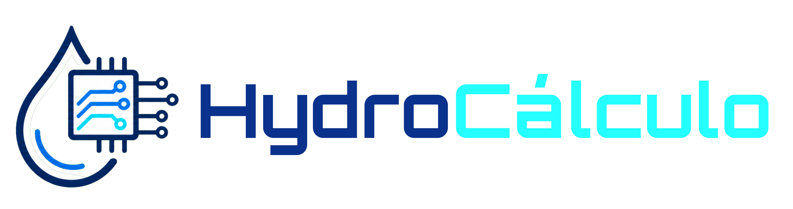

  

Website that uses a software to calculate the spent of water by the users of AI per week.

Created by Terry - Information Systems studant

# Technologies

  
  
  
  
  

# Methodology

The software combines the selected values from the five metrics and applies weighting factors derived from academic and technical studies on AI infrastructure, energy consumption, and water usage in data centers.
The final result represents an estimated weekly water consumption associated with the user's AI activities.

How it works:
HydroCalculation estimates the weekly water footprint generated by AI usage. The calculation is based on five user-related metrics, each assigned a different weight according to its expected computational demand and resource consumption.

Metrics Used in the Calculation:
  <ol>
    <li> Type of usage: Different AI tasks require different amounts of computing power and therefore have different water footprints.  </li>
          <ul>     
               <li> quick questions
               <li> texts and abstracts generation
               <li> coding and programming
               <li> Images generation
               <li> Video generation  
          </ul>
    <li> Frequency of Use: How often the user interacts with AI systems.  </li>
          <ul>      
               <li> Rarely
               <li> A few times per week
               <li> Daily
               <li> Multiple times per day
          </ul>
    <li> Average Session Duration: The typical amount of time spent using AI during a session. </li>
          <ul>
               <li> Up to 10 minutes
               <li> 10–30 minutes
               <li>  30–60 minutes
               <li> More than 1 hour
          </ul>
    <li> Average Prompt Complexity: The average size and complexity of user prompts. </li>
          <ul>      
               <li> Short prompts
               <li> Medium-length prompts
               <li> Long prompts
               <li> Highly detailed or complex prompts
          </ul>
    <li> AI Model Used: Different AI models may require different computational resources. </li>
          <ul>
             <li> ChatGPT
             <li> Gemini
             <li> Claude
             <li> DeepSeek
             <li> Perplexity
             <li> Other AI models  
          </ul>
   </ol>

